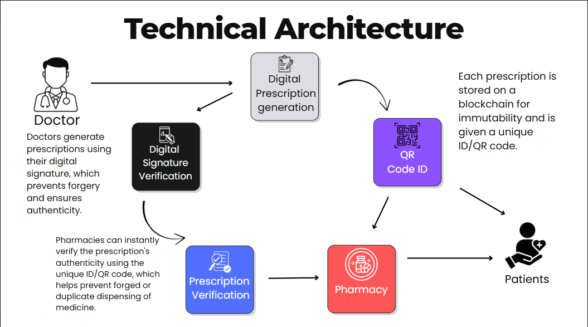
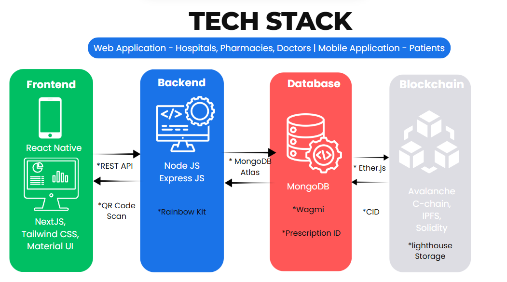
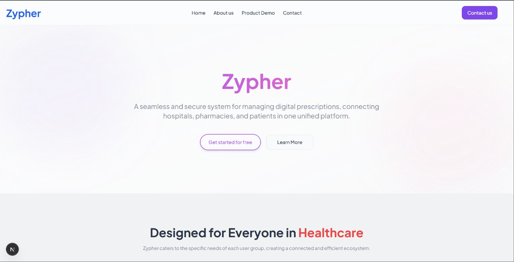
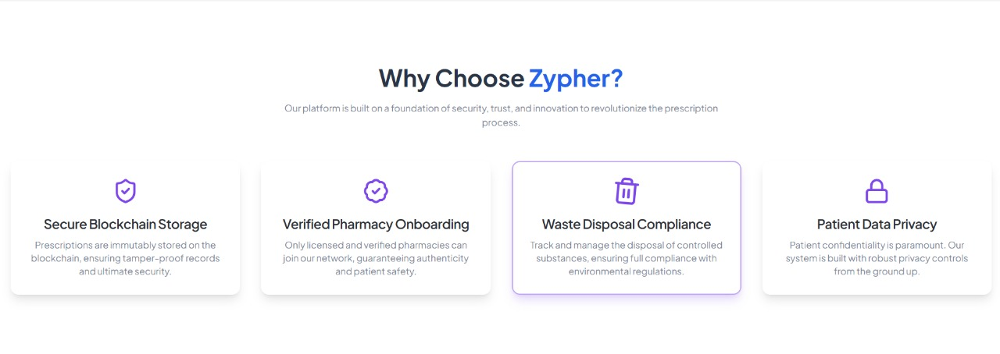
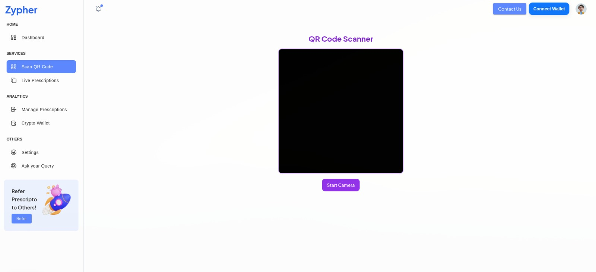
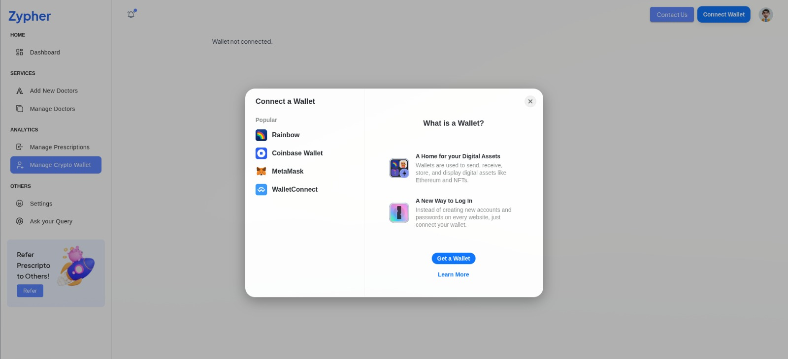
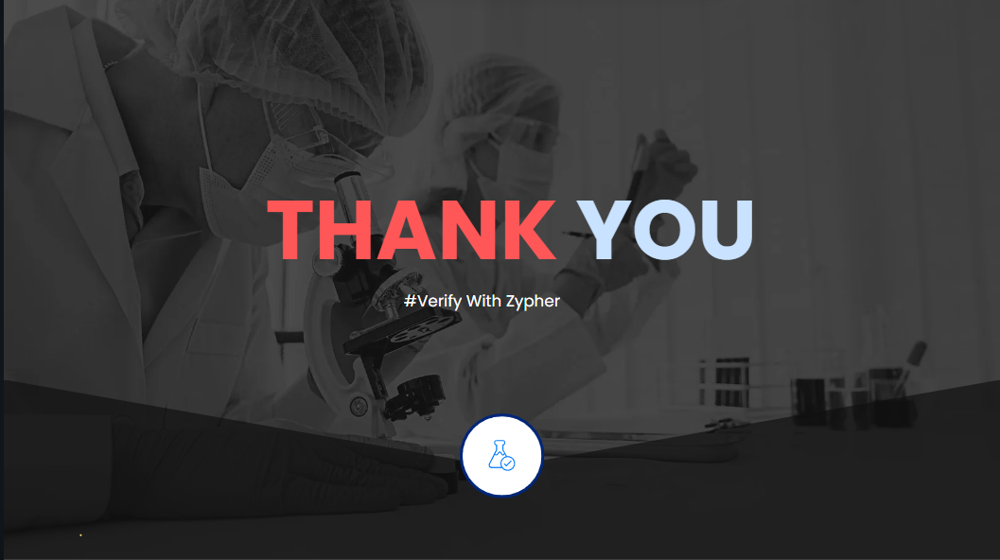

# **Binorix** - Prescriptions on Blockchain


## Secure Digital Prescription System for Hospitals & Pharmacies

binorix aims to revolutionize prescriptions by creating a **secure, paperless prescription system**:

- Doctors generate prescriptions using their **digital signature** by their wallet, preventing forgery and ensuring authenticity.  
- Each prescription is stored on a **IPFS Storage** which create a unique **CID** and it will based to Smart Contracts on Avalanche C-Chain.
- Smart Contract will create a unique **Prescription ID** and Store it along with **CID**, **TimeStamp** on the block. So the prescription will eadily verified with Prescription ID and get the list from CID.
- At last, It will genearate a **QR Code** whicjh contains Patient Wallet, Doctor Wallet and Prescription ID for Verification and Authenticity of Medicines.
- Pharmacies will scan the QR Code and ask permission to accept the request from Patient Wallet. Once the Patient Accepted, it will be updated in Pharmacy Dashboard. 
- Patients can access their prescriptions anytime via a secure mobile app and allow access to anyone which inidcates **Own your Data**.
- Hopitals can see list of doctors, Edit Informations, View Prescriptions list signed by doctors having full transaparncey and Authenticity.


## Architecture Diagram



---

## Content Overview <a name="content-overview"></a>

- [Project Vision](#project-vision)  
- [Technologies Used](#technologies-used)  
- [Getting Started](#getting-started)  
- [Project Overview](#project-overview)  
- [Key Features](#key-features)  
- [Team Fsociety](#team-zypher)  
- [Hackathons and Events](#hackathons-and-events)  
- [License](#license)  
- [Contact](#contact)  

---

## Project Vision <a name="project-vision"></a>

Our vision is to create a secure, transparent, and decentralized prescription management system that empowers doctors and patients with trust and authenticity through blockchain technology.

[⬆️ Back to Top](#zypher---Prescriptions-on-Blockchain)


---

## Technologies Used <a name="technologies-used"></a>



| Tech stack         | Technology used                                                                               |
|--------------------|---------------------------------------------------------------------------------------------|
| **Blockchain**     |      |
|                    |   |
| **Frontend**       |         |
|                    |               |
|                    |  |
| **Backend**        |         |
|                    |      |
| **Database**       |         |
|                    |                  |
| **Deployment**     |             |
|                    |            |
| **Other**          |              |

[⬆️ Back to Top](#zypher---Prescriptions-on-Blockchain)

---

## Getting Started <a name="getting-started"></a>

### Installation

1. **Clone the Repository**
    ```bash
    git clone https://github.com/Madan94/zypher.git
    cd binorix
    ```

2. **Dowload all the Project Dependencies**
    ```bash
    npm install
    ```

3. **Start the Development Server**
    ```bash
    npm run dev
    ```
4. **Backend Repo Link**
    Repo link - [https://github.com/PRIEYAN/binorix-backend](https://github.com/PRIEYAN/Binorix-backend)
    ```bash
    npm install
    node server.js
    ```
5. **Android App Repo Link**
    Repo link [https://github.com/Madan94/binorix_patient](https://github.com/Madan94/binorix_patient)
   ```bash
   npm install
   npx react-native start
   npx react-native run-android
   ```

[⬆️ Back to Top](#binorix---Prescriptions-on-Blockchain)

---

## Project Overview <a name="project-overview"></a>

Binorix leverages blockchain technology to ensure the security and integrity of medical prescriptions. It provides a decentralized platform where doctors can generate, sign, and manage prescriptions while patients can securely access their medical records.

[⬆️ Back to Top](#binorix---Prescriptions-on-Blockchain)

---

## Key Features <a name="key-features"></a>

- **Blockchain Integration:**  
  Utilizes blockchain to store prescription data, ensuring tamper-proof records.

- **User Authentication:**  
  Employs secure wallet-based login mechanisms to protect user data.

- **Prescription Management:**  
  Allows healthcare professionals to generate, view, and manage prescriptions efficiently.

- **Patient Records:**  
  Enables patients to access their prescription history securely.

[⬆️ Back to Top](#binorix---Prescriptions-on-Blockchain)

## Screenshots <a name="screenshots"></a>

## 📸 Screenshots

<table>
  <thead>
    <tr>
      <th>Landing Page</th>
      <th>Role Selection</th>
    </tr>
  </thead>
  <tbody>
    <tr>
      <td></td>
      <td></td>
    </tr>
  </tbody>
  
  <thead>
    <tr>
      <th>About Binorix</th>
      <th>Pharmacy Core</th>
    </tr>
  </thead>
  <tbody>
    <tr>
      <td></td>
      <td></td>
    </tr>
  </tbody>
  
  <thead>
    <tr>
      <th>Doctor Core</th>
      <th>Hospital Core</th>
    </tr>
  </thead>
  <tbody>
    <tr>
      <td></td>
      <td></td>
    </tr>
  </tbody>
</table>


[⬆️ Back to Top](#binorix---Prescriptions-on-Blockchain)

---

## Team Fsociety <a name="team-binorix"></a>

- **Madhanraj M** – Team Lead, Full Stack & Web3 Developer  
- **Prieyan MN** – Backend Developer  
- **M Shyam Sundar** – Frontend & App Developer  
- **CR Raakesh** – Backend Developer 

[⬆️ Back to Top](#binorix---Prescriptions-on-Blockchain)

---

## Hackathons and Events <a name="hackathons-and-events"></a>

- Participated in **BNB Chine Web3 Hackathon** at thane Mumbai

[⬆️ Back to Top](#binorix---Prescriptions-on-Blockchain)

---

## License <a name="license"></a>

This project is licensed under the MIT License. See the [LICENSE](https://github.com/Madan94/binorix/blob/main/LICENSE) file for details.

[⬆️ Back to Top](#binorix---Prescriptions-on-Blockchain)

---

## Contact <a name="contact"></a>

For any inquiries or support, feel free to reach out:

- **Email:** [](mailto:madhanwebdev94@gmail.com)  
- **LinkedIn:**  
**Madhanraj M** - [](https://www.linkedin.com/in/madhan-fullstack-developer/)  
**Prieyan M N** - [](https://www.linkedin.com/in/prieyanmn2007/)
  <br/>
**Madesh Vaithya H** - [](https://www.linkedin.com/in/madesh-vaithya-app-developer/)

---



---

[⬆️ Back to Top](#binorix---Prescriptions-on-Blockchain)

---

*Made with ❤️ by Team FSociety🔥.*